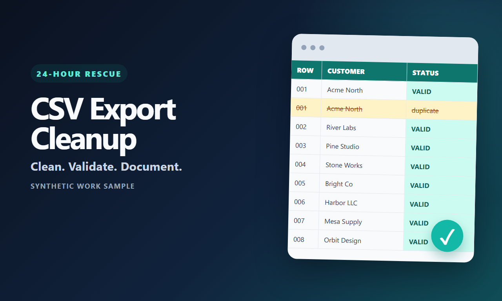

# Spreadsheet Rescue

Spreadsheet Rescue is a dependency-free Python CLI for delivering a polished
**24-Hour Spreadsheet Rescue** service. It cleans CSV exports, removes exact
duplicate rows, normalizes explicitly configured date/currency/phone fields,
and produces both machine-readable and client-friendly change reports.

It is deliberately conservative: if a typed value cannot be recognized
unambiguously, it is left unchanged and counted in the report.



## Need the cleanup done for you?

I offer a privacy-conscious Spreadsheet Rescue service for CSV files, including
CSV exports from Excel, Google Sheets, and other spreadsheet applications:

- **Quick rescue — $29:** one CSV export, up to 2,500 rows.
- **Full rescue — from $79:** up to three compatible CSV exports, including a
  validation summary.
- **Repeatable cleanup — from $149:** a reusable CSV cleanup recipe or script
  plus a written walkthrough.

[View packages, safeguards, and Venmo/PayPal terms](https://jackgpt.org/#/hire/spreadsheet-rescue),
[Request a quote by email](mailto:jvan8076@gmail.com?subject=Spreadsheet%20Rescue%20inquiry&body=Source%20application%20%28optional%29%3A%0ACSV%20exports%20and%20approximate%20rows%3A%0ACleanup%20needed%3A%0ADeadline%3A%0A%0APlease%20do%20not%20attach%20confidential%20files%20to%20this%20first%20email.)
or review the [three-page work sample](docs/spreadsheet-rescue-portfolio.pdf).

Please do not send confidential files in the first message. Describe the file,
row count, desired cleanup, and deadline first so scope and data handling can be
agreed before any transfer.

## What it does

- Trims and normalizes headers; blank and duplicate headers receive stable names.
- Trims cell whitespace (internal whitespace collapsing is opt-in).
- Removes exact duplicate rows *after* configured normalization.
- Optionally removes fully blank rows.
- Normalizes only the date, currency, and phone columns named in the config.
- Preserves unrecognized or ambiguous values instead of guessing.
- Writes a cleaned CSV, JSON audit, and Markdown change report.
- Supports a zero-write dry run.
- Never overwrites the input or any existing output file.
- Never puts raw cell values into logs or audit reports.

Runtime requirements: Python 3.10+ and the Python standard library. No customer
file is uploaded anywhere by this tool.

## Quick start

From this directory:

```powershell
python -m spreadsheet_rescue .\customer_export.csv --config .\sample_config.json --dry-run
python -m spreadsheet_rescue .\customer_export.csv --config .\sample_config.json
```

The second command creates `customer_export_rescue` beside the input containing:

```text
customer_export_cleaned.csv
customer_export_changes.json
customer_export_changes.md
```

To install the verified 1.0.0 wheel directly from GitHub:

```powershell
python -m pip install https://github.com/jackvansickle1/spreadsheet-rescue/releases/download/v1.0.0/spreadsheet_rescue-1.0.0-py3-none-any.whl
spreadsheet-rescue .\customer_export.csv -c .\sample_config.json --dry-run
```

For an editable local install instead:

```powershell
python -m venv .venv
.\.venv\Scripts\Activate.ps1
python -m pip install -e .
spreadsheet-rescue .\customer_export.csv -c .\sample_config.json --dry-run
```

## Safe fulfillment workflow

1. Keep the untouched client file in a job-specific folder.
2. Copy and edit `sample_config.json` so semantic columns are explicit.
3. Run `--dry-run`; inspect counts and warnings printed to the console.
4. Run without `--dry-run`; existing output files cause a safe failure.
5. Review the cleaned CSV and Markdown report before delivery.
6. Deliver the cleaned CSV and reports, retaining the input SHA-256 in the audit
   as evidence of exactly which source file was processed.

Use a new output directory or prefix for a rerun. There is intentionally no
`--force` switch.

## Configuration

Configuration is strict JSON. Unknown keys fail fast so a typo does not silently
skip cleanup. See `sample_config.json` for a complete example.

### CSV and whitespace

- `csv.delimiter`: `"auto"` (comma, semicolon, tab, or pipe) or one explicit character.
- `csv.encoding`: input encoding; default `utf-8-sig` accepts Excel's UTF-8 BOM.
- `csv.output_encoding`: output encoding; default `utf-8-sig` for Excel compatibility.
- `headers.case`: `preserve`, `lower`, `upper`, or `snake`.
- `whitespace.trim`: strips leading/trailing whitespace.
- `whitespace.collapse_internal`: converts internal whitespace runs to one space;
  defaults to `false` because internal spacing can be meaningful.
- `rows.remove_blank` and `rows.remove_exact_duplicates`: safe row cleanup switches.
- `behavior.missing_columns`: `error` (default) or `warn`.
- `security.formula_policy`: `warn` (preserve and report formula-like cells) or
  `neutralize` (prefix them with an apostrophe and report the count).

Rows wider than the source header are preserved under generated
`extra_column_N` headers. Short rows are padded with empty cells. Both are
reported without logging cell contents.

### Dates

Dates are parsed only with the formats you list. If two formats interpret a value
differently (for example, `%m/%d/%Y` and `%d/%m/%Y` for `03/04/2026`), the value
is left unchanged and counted as ambiguous.

```json
{
  "column": "Order Date",
  "input_formats": ["%Y-%m-%d", "%m/%d/%Y"],
  "output_format": "%Y-%m-%d"
}
```

Formats use Python `strptime`/`strftime` directives.

### Currencies

Currency parsing validates grouping and separators before changing anything.
Symbols are removed only at the edges. Parenthesized negatives are supported
when enabled.

```json
{
  "column": "Amount",
  "symbols": ["$", "USD"],
  "decimal_separator": ".",
  "thousands_separator": ",",
  "decimal_places": 2,
  "allow_parentheses": true
}
```

### Phones

Phone cleanup accepts common punctuation but transforms only plausible lengths.
Numbers already beginning with `+` must contain 8–15 digits. Numbers without `+`
must match a configured national length (or already include the configured
country code).

```json
{
  "column": "Phone",
  "default_country_code": "1",
  "national_lengths": [10],
  "output_format": "international",
  "allow_extensions": true
}
```

`international` produces `+<country-and-number>` and retains an extension as
` x<extension>`. `e164` produces strict E.164-like digits with a leading `+` and
therefore leaves values with extensions unchanged. `digits` omits the `+` and
also leaves extensions unchanged. `rfc3966` produces values such as
`tel:+13125550199;ext=42`.

This is syntactic normalization, not telecom-number validation.

## Reports and privacy

The JSON audit is suitable for automation. The Markdown report is suitable for
client delivery. Reports include:

- input/output row counts and SHA-256 fingerprints;
- duplicate/blank removal counts;
- aggregate changes and warnings per configured field;
- original-to-cleaned header mapping; and
- detected delimiter and declared encodings.

They do **not** include raw cell values, rejected-value samples, or row-level
data. File names and header names do appear; rename them before processing if
those labels themselves are sensitive.

Cells beginning with `=`, `+`, `-`, `@`, tab, carriage return, or newline may be
treated as formulas by spreadsheet applications. The default `warn` policy
preserves data and adds an aggregate warning. For untrusted CSVs, use
`neutralize` and review the resulting leading apostrophes before delivery.

The CLI prints only aggregate counts, aggregate warning details, configured
column names, and output paths.

## Synthetic demo

```powershell
python .\scripts\generate_demo.py .\demo
python -m spreadsheet_rescue .\demo\demo_dirty.csv -c .\demo\demo_config.json --dry-run
python -m spreadsheet_rescue .\demo\demo_dirty.csv -c .\demo\demo_config.json
```

The generator uses clearly labeled fictional composite names and synthetic
555-style phone numbers; no row describes a real person or customer. It uses
exclusive file creation, so it will not replace an earlier demo.

## Tests

```powershell
python -m unittest discover -s tests -v
```

## Scope

This version processes one CSV in memory. It does not modify formulas, XLSX
workbooks, merged cells, styling, or multiple sheets. Export a workbook sheet to
CSV first, and always review the result before treating it as production data.

## License

MIT — see `LICENSE`.
